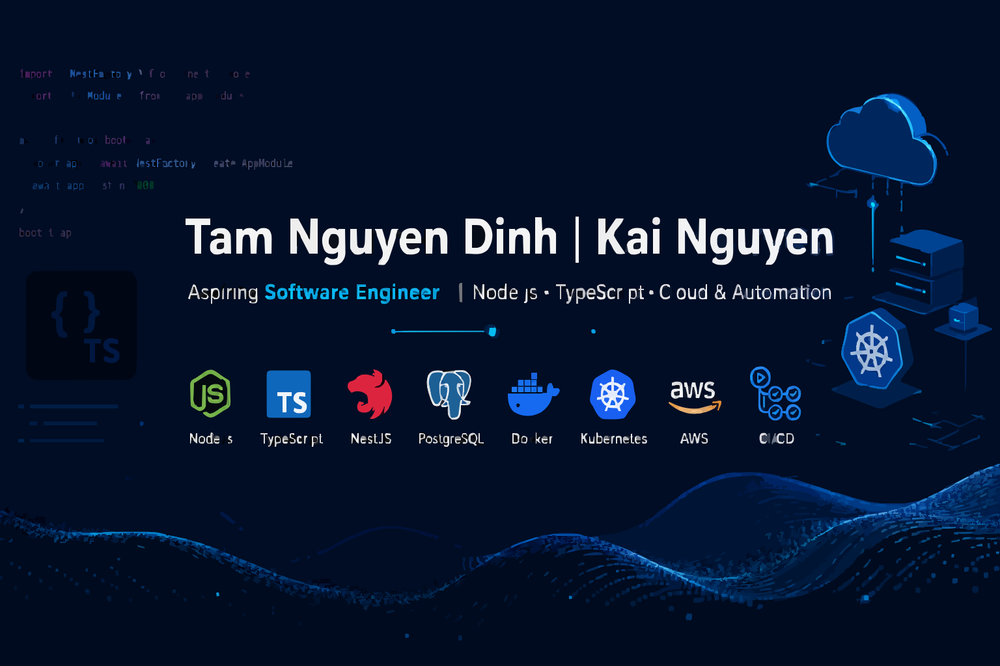
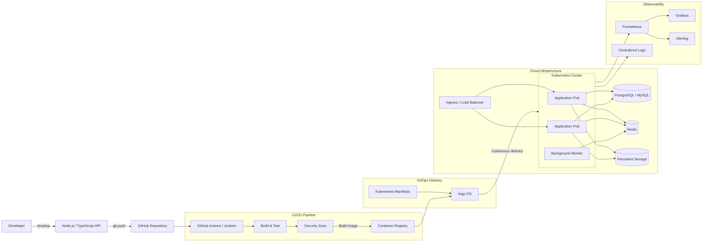

<p align="center">
  <a href="https://git.io/typing-svg">
    
  </a>
</p>

<p align="center">
  
  
  
</p>

<p align="center">
  <a href="mailto:kainguyen615@gmail.com">
    
  </a>
  <a href="https://linkedin.com/in/tamnguyendinh615">
    
  </a>
  <a href="https://github.com/kaing615">
    
  </a>
  <a href="https://drive.google.com/file/d/1IdYpM2aDYfHiAtUJvQSGK_Z6H3fQV9U3/view?usp=sharing">
    
  </a>
</p>

---

## `$ whoami`

I'm **Tam Nguyen Dinh**, also known as **Kai Nguyen**, a Software Engineer focused on backend development, internal platforms and reliable software delivery.

I enjoy building applications and backend services with **Node.js** and **TypeScript**, then taking them all the way to production through containers, CI/CD, cloud infrastructure and observability.

<table>
  <tr>
    <td><strong>Current role</strong></td>
    <td>Software Engineer Intern</td>
  </tr>
  <tr>
    <td><strong>Core focus</strong></td>
    <td>Backend engineering, internal platforms and software delivery</td>
  </tr>
  <tr>
    <td><strong>Currently learning</strong></td>
    <td>Node.js, TypeScript, backend architecture and cloud-native systems</td>
  </tr>
  <tr>
    <td><strong>Technical interests</strong></td>
    <td>Backend systems, platform engineering and cloud-native architecture</td>
  </tr>
  <tr>
    <td><strong>Open to</strong></td>
    <td>Software engineering, backend and platform engineering projects</td>
  </tr>
  <tr>
    <td><strong>Career goal</strong></td>
    <td>Build reliable, scalable and maintainable software systems</td>
  </tr>
</table>

---

## `$ current_focus`

```text
CODE ──► API ──► TEST ──► CONTAINERIZE ──► DEPLOY ──► OBSERVE
Node/TS   REST      CI/CD         Docker        K8s/AWS      Grafana
```

> Build useful software, automate delivery and keep production systems reliable.

### How I approach engineering

- Design maintainable backend services and APIs with clear responsibilities.
- Use TypeScript and structured application architecture to keep code predictable and easier to evolve.
- Build reproducible environments with containers and automated delivery workflows.
- Keep deployments small, traceable and easy to roll back.
- Treat monitoring and observability as part of the software lifecycle.
- Document systems and workflows so they remain maintainable by the whole team.

---

## `$ system --overview`

A software delivery architecture connecting backend services, data stores, CI/CD, containers, cloud infrastructure and observability.



### Deployment flow

```text
DEVELOPER
    │
    ▼
GIT PUSH
    │
    ▼
BUILD ──► TEST ──► SECURITY SCAN
    │
    ▼
CONTAINER REGISTRY
    │
    ▼
ARGO CD ──► KUBERNETES
               │
               ├──► APPLICATION
               ├──► DATABASE
               ├──► CACHE
               └──► MONITORING
```

### Engineering principles

- **Maintainable backend services:** Keep application logic structured, testable and easy to evolve.
- **Reliable data access:** Use relational databases and caching appropriately for application workloads.
- **Automated delivery:** Build, test and package applications through CI pipelines.
- **Containerized workloads:** Package services as reproducible Docker images.
- **Declarative deployment:** Manage Kubernetes resources through version-controlled manifests.
- **GitOps workflow:** Use Argo CD to synchronize declared and running states.
- **Observable systems:** Collect metrics, logs, dashboards and operational alerts.
- **Secure pipeline:** Add dependency, source-code and container-image scanning before deployment.

---

## `$ toolkit --list`

### Backend & Software Engineering

<p align="left">
  
</p>

### Databases & Caching

<p align="left">
  
</p>

### Cloud, Infrastructure & DevOps

<p align="left">
  
</p>

<p align="left">
  
  
  
  
</p>

### Additional Development Tools

<p align="left">
  
</p>

---

## `$ capabilities --summary`

| Area | Technologies and practices |
| --- | --- |
| **Backend** | Node.js, TypeScript, Express and REST API development |
| **Databases** | PostgreSQL, MySQL, MongoDB and Redis |
| **Containers** | Docker, container images, volumes, networking and Docker Compose |
| **CI/CD** | GitHub Actions, Jenkins, automated build, test and deployment workflows |
| **Cloud** | AWS fundamentals, cloud infrastructure and deployment architecture |
| **Orchestration** | Kubernetes fundamentals, workloads, services and configuration |
| **GitOps** | Argo CD and declarative application delivery |
| **Observability** | Grafana, monitoring concepts, metrics and service visibility |
| **Automation** | Bash, Python scripting and repeatable operational workflows |
| **Systems** | Linux administration, networking and troubleshooting |

---

## `$ github --stats`

<p align="center">
  
</p>

---

## `$ connect --with-me`

<p align="center">
  Interested in software engineering, backend systems or cloud-native platforms?
  <br />
  Feel free to contact me about projects, internship opportunities or technical collaboration.
</p>

<p align="center">
  <a href="mailto:kainguyen615@gmail.com">
    
  </a>
  <a href="https://linkedin.com/in/tamnguyendinh615">
    
  </a>
</p>

<details>
  <summary><strong>Personal social profiles</strong></summary>

  <br />

  <p align="left">
    <a href="https://facebook.com/dtam215">
      
    </a>
    <a href="https://instagram.com/dtam_.21">
      
    </a>
  </p>
</details>

<br />

<p align="center">
  <sub>Building software. Automating delivery. Running it reliably.</sub>
</p>


