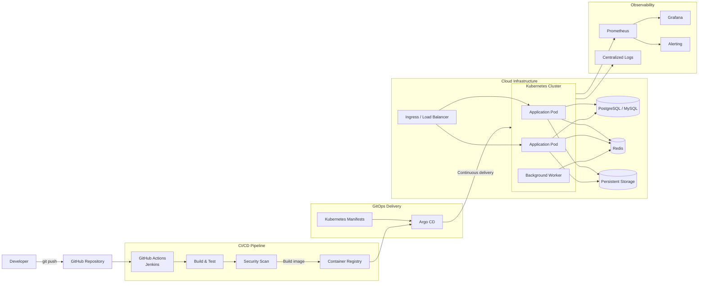

<p align="center">
  <a href="https://git.io/typing-svg">
    
  </a>
</p>

<p align="center">
  
  
  
</p>

<p align="center">
  <a href="mailto:kainguyen615@gmail.com">
    
  </a>
  <a href="https://linkedin.com/in/tamnguyendinh615">
    
  </a>
  <a href="https://github.com/kaing615">
    
  </a>
  <a href="https://drive.google.com/file/d/1IdYpM2aDYfHiAtUJvQSGK_Z6H3fQV9U3/view?usp=sharing">
    
  </a>
</p>

---

## `$ whoami`

I'm **Tam Nguyen Dinh**, also known as **Kai Nguyen**, a DevOps Engineer focused on building reliable, automated and observable software delivery workflows.

I enjoy transforming application code into repeatable infrastructure through containers, CI/CD pipelines, cloud services and automation.

<table>
  <tr>
    <td><strong>Current role</strong></td>
    <td>DevOps Engineer Intern</td>
  </tr>
  <tr>
    <td><strong>Core focus</strong></td>
    <td>Cloud infrastructure, containers and CI/CD</td>
  </tr>
  <tr>
    <td><strong>Currently learning</strong></td>
    <td>Kubernetes, Argo CD, GitHub Actions and advanced CI/CD</td>
  </tr>
  <tr>
    <td><strong>Technical interests</strong></td>
    <td>Automation, observability and cloud-native architecture</td>
  </tr>
  <tr>
    <td><strong>Open to</strong></td>
    <td>DevOps, backend and cloud-native projects</td>
  </tr>
  <tr>
    <td><strong>Career goal</strong></td>
    <td>Build secure, scalable and developer-friendly platforms</td>
  </tr>
</table>

---

## `$ current_focus`

```text
SOURCE ──► BUILD ──► TEST ──► CONTAINERIZE ──► DEPLOY ──► OBSERVE
  Git        CI/CD             Docker          K8s          Grafana
                                              Argo CD
```

> Automate repetitive work, keep deployments predictable and make systems observable.

### How I approach engineering

* Automate repeatable processes to reduce manual errors.
* Build reproducible environments using containers and infrastructure configuration.
* Keep deployments small, traceable and easy to roll back.
* Add monitoring and observability instead of treating them as afterthoughts.
* Document workflows so systems remain maintainable by the whole team.

---

---

## `$ infrastructure --overview`

<p align="left">
  A cloud-native delivery architecture that connects source control, CI/CD, containers, Kubernetes, GitOps and observability.
</p>



### Deployment flow

```text
DEVELOPER
    │
    ▼
GIT PUSH
    │
    ▼
BUILD ──► TEST ──► SECURITY SCAN
    │
    ▼
CONTAINER REGISTRY
    │
    ▼
ARGO CD ──► KUBERNETES
               │
               ├──► APPLICATION
               ├──► DATABASE
               ├──► CACHE
               └──► MONITORING
```

### Infrastructure principles

* **Automated delivery:** Build, test and package applications through CI pipelines.
* **Containerized workloads:** Package services as reproducible Docker images.
* **Declarative deployment:** Manage Kubernetes resources through version-controlled manifests.
* **GitOps workflow:** Use Argo CD to synchronize declared and running states.
* **Scalable services:** Run multiple application replicas behind an ingress layer.
* **Observable systems:** Collect metrics, logs, dashboards and operational alerts.
* **Persistent data:** Separate stateless application workloads from databases and storage.
* **Secure pipeline:** Add dependency, source-code and container-image scanning before deployment.

## `$ toolkit --list`

### Cloud, Infrastructure & DevOps

<p align="left">
  
</p>

<p align="left">
  
  
  
  
</p>

### Backend & Programming Languages

<p align="left">
  
</p>

### Databases & Caching

<p align="left">
  
</p>

### Web, AI & Development Tools

<p align="left">
  
</p>

---

## `$ capabilities --summary`

| Area              | Technologies and practices                                              |
| ----------------- | ----------------------------------------------------------------------- |
| **Containers**    | Docker, container images, volumes, networking and Docker Compose        |
| **Orchestration** | Kubernetes fundamentals, workloads, services and configuration          |
| **CI/CD**         | GitHub Actions, Jenkins, automated build, test and deployment workflows |
| **GitOps**        | Argo CD and declarative application delivery                            |
| **Cloud**         | AWS fundamentals, cloud infrastructure and deployment architecture      |
| **Observability** | Grafana, monitoring concepts, metrics and service visibility            |
| **Automation**    | Bash, Python scripting and repeatable operational workflows             |
| **Backend**       | Node.js, Express, FastAPI and REST API development                      |
| **Systems**       | Linux administration, networking and troubleshooting                    |

---

## `$ github --stats`

<p align="center">
  
  
</p>

<p align="center">
  
</p>

---

## `$ connect --with-me`

<p align="center">
  Interested in DevOps, backend or cloud-native engineering?
  <br />
  Feel free to contact me about projects, internship opportunities or technical collaboration.
</p>

<p align="center">
  <a href="mailto:kainguyen615@gmail.com">
    
  </a>
  <a href="https://linkedin.com/in/tamnguyendinh615">
    
  </a>
</p>

<details>
  <summary><strong>Personal social profiles</strong></summary>

  <br />

  <p align="left">
    <a href="https://facebook.com/dtam215">
      
    </a>
    <a href="https://instagram.com/dtam_.21">
      
    </a>
  </p>
</details>

<br />

<p align="center">
  <sub>Learning continuously. Automating thoughtfully. Building reliably.</sub>
</p>


